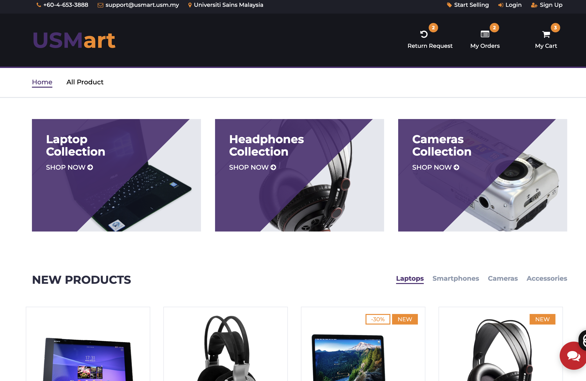
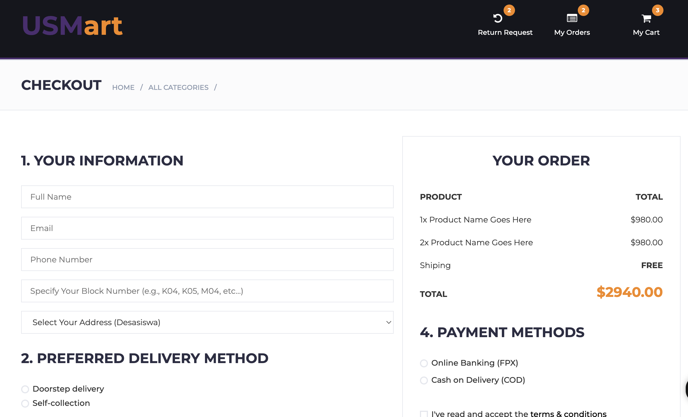

# USMart - Student Marketplace


## 🎓 About USMart

USMart is USM's trusted student marketplace platform designed for buying and selling secondhand items within the campus community. We connect students across Universiti Sains Malaysia to trade electronics, furniture, books, and more in a safe and convenient environment.

**Mission:** Save money, reduce waste, and support fellow students through sustainable peer-to-peer commerce.

---

## ✨ Features

- 🛍️ **Browse Products** - Explore various categories including laptops, smartphones, cameras, and accessories
- 🛒 **Shopping Cart** - Add multiple items and checkout seamlessly
- 💬 **Live Chat** - Communicate with sellers in real-time
- 👤 **User Profiles** - Manage your listings and track orders
- 🔄 **Return System** - Request returns with built-in tracking
- 📦 **Order Management** - View order history and status
- 🔍 **Advanced Filtering** - Filter by category, brand, and price range
- 📱 **Responsive Design** - Works perfectly on desktop, tablet, and mobile

---

## 🚀 Live Demo

[View Live Demo](#) *(Add your deployment link here)*

---

## 📸 Screenshots

### Homepage


### Product Listing


### Shopping Cart


---

## 🛠️ Technologies Used

### Frontend
- **HTML5** - Semantic markup
- **CSS3** - Custom styling with responsive design
- **JavaScript (jQuery)** - Interactive functionality
- **Bootstrap 3** - Responsive grid system
- **Slick Carousel** - Product sliders
- **Font Awesome** - Icons

### Libraries & Plugins
- jQuery 3.x
- Bootstrap 3.3.7
- Slick Slider
- noUiSlider (Price range filter)
- jQuery Zoom (Product image zoom)

---

## 📁 Project Structure

```
USMart/
│
├── css/
│   ├── bootstrap.min.css      # Bootstrap framework
│   ├── style.css               # Main stylesheet (all custom styles)
│   ├── slick.css               # Slider styles
│   ├── nouislider.min.css      # Price slider styles
│   └── font-awesome.min.css    # Icon fonts
│
├── js/
│   ├── jquery.min.js           # jQuery library
│   ├── bootstrap.min.js        # Bootstrap JS
│   ├── main.js                 # Custom JavaScript (cleaned & optimized)
│   ├── slick.min.js            # Carousel functionality
│   ├── nouislider.min.js       # Price range slider
│   └── jquery.zoom.min.js      # Image zoom
│
├── img/                        # Product images and assets
├── fonts/                      # Custom fonts
├── screenshot/                 # Project screenshots
│
├── index.html                  # Homepage
├── store.html                  # Product listing page
├── product.html                # Product details page
├── cart.html                   # Shopping cart
├── checkout.html               # Checkout page
├── profile.html                # User profile (seller)
├── profile_buyer.html          # User profile (buyer)
├── orderlist.html              # Order history
├── chat.html                   # Chat interface
├── conversation.html           # Chat conversations
├── addItem.html                # Add new product
├── mysale.html                 # Seller's listings
├── returnpage.html             # Return requests (buyer)
├── returnseller.html           # Return management (seller)
├── returnform.html             # Return form
├── login.html                  # Login page
├── signup.html                 # Registration page
├── logout.html                 # Logout page
├── order-success.html          # Order confirmation
│
└── README.md                   # Project documentation
```

---

## 🔧 Installation & Setup

### Prerequisites
- A modern web browser (Chrome, Firefox, Safari, Edge)
- Text editor (VS Code, Sublime Text, etc.) - for development
- Git (for version control)

### Local Setup

1. **Clone the repository**
   ```bash
   git clone https://github.com/anisha-rhea-aggarwal/my-assignment-project.git
   cd my-assignment-project
   ```

2. **Open in browser**
   ```bash
   # Simply open index.html in your browser
   open index.html
   # OR
   # Right-click index.html → Open with → Your Browser
   ```

3. **For development with live server (Optional)**
   
   If using VS Code:
   - Install "Live Server" extension
   - Right-click `index.html` → "Open with Live Server"
   
   OR use Python:
   ```bash
   # Python 3
   python3 -m http.server 8000
   
   # Python 2
   python -m SimpleHTTPServer 8000
   
   # Then open http://localhost:8000
   ```

---

## 📝 Usage Guide

### For Buyers

1. **Browse Products**
   - Visit homepage or "All Products" page
   - Use filters to narrow down results
   - Click on products for details

2. **Add to Cart**
   - Click "Add to Cart" button on product
   - View cart from header icon
   - Proceed to checkout

3. **Place Order**
   - Fill in shipping details
   - Select payment method
   - Confirm order

4. **Track Orders**
   - Go to "My Orders" from header
   - View order status
   - Request returns if needed

### For Sellers

1. **Create Account**
   - Click "Sign Up" in header
   - Fill in registration details
   - Verify email (if implemented)

2. **List Items**
   - Click "Start Selling" in header
   - Go to "Add Item"
   - Upload photos and details
   - Set price and quantity

3. **Manage Listings**
   - View "My Sales" for active listings
   - Edit or remove items
   - Track buyer inquiries

4. **Handle Orders**
   - View orders in dashboard
   - Process returns
   - Manage inventory

---

## 🎨 Design System

### Color Palette

- **Primary Purple:** `#4c2e71` - Main brand color, buttons, links
- **Secondary Orange:** `#f68714` - Accents, prices, highlights
- **Dark Background:** `#15161D`, `#1E1F29` - Header, footer
- **Light Grey:** `#E4E7ED`, `#FBFBFC` - Borders, backgrounds
- **Text Colors:** 
  - Body: `#333`
  - Headers: `#2B2D42`
  - Muted: `#8D99AE`

### Typography

- **Font Family:** Montserrat (Google Fonts)
- **Weights:** 400 (Regular), 500 (Medium), 700 (Bold)

### Responsive Breakpoints

- Desktop: `> 992px`
- Tablet: `768px - 991px`
- Mobile: `< 767px`

---

## 🧹 Code Quality

This project follows clean code principles:

- ✅ **No inline CSS** - All styles consolidated in `style.css`
- ✅ **Optimized JavaScript** - Efficient, well-commented code
- ✅ **Semantic HTML** - Proper use of HTML5 elements
- ✅ **Responsive Design** - Mobile-first approach
- ✅ **Modular Structure** - Organized file structure
- ✅ **Comments** - Code documentation for maintainability

---

## 🤝 Contributing

Contributions are welcome! If you'd like to improve USMart:

1. Fork the repository
2. Create a feature branch (`git checkout -b feature/AmazingFeature`)
3. Commit your changes (`git commit -m 'Add some AmazingFeature'`)
4. Push to the branch (`git push origin feature/AmazingFeature`)
5. Open a Pull Request

### Coding Standards

- Use meaningful variable and function names
- Add comments for complex logic
- Test on multiple browsers before submitting
- Follow existing code style and structure
- Update documentation if needed

---

## 🐛 Known Issues

- Chat feature requires backend implementation for real-time functionality
- Payment gateway integration pending
- Email notifications not yet implemented
- Search functionality needs backend API

---

## 🔮 Future Enhancements

- [ ] Backend API integration (Node.js/PHP)
- [ ] Database implementation (MySQL/MongoDB)
- [ ] User authentication system
- [ ] Real-time chat with WebSocket
- [ ] Payment gateway integration
- [ ] Email notifications
- [ ] Advanced search with filters
- [ ] Product reviews and ratings
- [ ] Wishlist functionality
- [ ] Mobile app version
- [ ] Admin dashboard
- [ ] Analytics and reporting

---

## 📄 License

This project is licensed under the MIT License - see the [LICENSE](LICENSE) file for details.

---

## 👥 Team / Authors

**Group 43 - CMT322 Web Engineering**

- Developers: 
    1. Anisha 
    2. Aleeya 
    3. Ainul 
    4. Fatin
    5. Anisah
- Institution: Universiti Sains Malaysia (USM)
- Course: CMT322 - Web Engineering
- Academic Year: 2025/2026

---

---

## 🙏 Acknowledgments

- Original template inspiration: [Electro eCommerce HTML Template](https://colorlib.com/)
- Icons: [Font Awesome](https://fontawesome.com/)
- Fonts: [Google Fonts - Montserrat](https://fonts.google.com/specimen/Montserrat)
- Carousel: [Slick Slider](https://kenwheeler.github.io/slick/)
- Bootstrap: [Bootstrap 3](https://getbootstrap.com/docs/3.3/)

---

## 📊 Project Status

🟢 **Active Development** - This project is actively maintained and updated.

**Last Updated:** 16 November 2025

---

<div align="center">

**Made with ❤️ for USM Students**

[⬆ Back to Top](#usmart---student-marketplace)

</div>